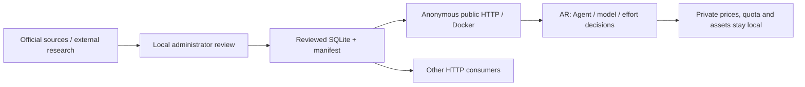

# agent-costbook

> Traceable costs and capabilities for AI agents.

[English](README.md) · [简体中文](README.zh-CN.md)

**agent-costbook** (`ac`) provides a public reference service and a local ledger for traceable AI model pricing, subscription terms, provenance evidence, and model-effort capability facts. It calculates reproducible task cost estimates (M0–M7) and provides factual capability records for AI agents.

Originally built to serve [agent-router](https://github.com/JarvanAI/agent-router) (`ar`) with verifiable pricing and capability facts—where `ac` maintains the evidence, timestamps, and estimate formulas while `ar` makes routing decisions—`ac` runs independently for any developer workflow or agent framework. All facts carry explicit freshness provenance (`retrieved_at`, `as_of`, `row_version`), unknown rates are exposed as `null` rather than zero, and calculations report assumptions explicitly without guessing.

## Public HTTP service (1.2)

AR can consume facts directly over HTTP, without installing AC, a CLI, or a consumer key. Administrators research and review locally; the public service is read-only, runs no AI, and stores no model API keys. Personal paid prices and remaining quota stay in the user's AR.

A public URL is not deployed yet. Run the same public entrypoint from a source checkout:

```sh
uv sync --locked
uv run uvicorn agent_costbook.public_api:create_public_app --factory --host 127.0.0.1 --port 8080 --no-access-log
curl --fail http://127.0.0.1:8080/v1/info
curl --fail http://127.0.0.1:8080/v1/capabilities
```

The reviewed artifact covers 17 OpenRouter price cards, 5 agents, and 33 model-effort rows. Estimates are `public-reference`, not personal paid costs; missing usage is never guessed. Conditional prices for 12 models remain gaps. AA scores and private quotas are excluded. See the [public contract](docs/design/public-service-1.2/spec.md), [sources and gaps](docs/research/public-catalog-20261008.md), and [Docker deployment](docs/deployment.md). The local admin service retains authentication and M0–M7; the public service exposes M0–M6.

## Installation

`agent-costbook` requires Python 3.12+ (which [uv](https://docs.astral.sh/uv/) can download and manage automatically).

### Standalone CLI tool (recommended)

Install `ac` directly from Git:

```sh
uv tool install git+https://github.com/JarvanAI/agent-costbook.git@v1.1.0
```

> [!NOTE]
> Git installation is pinned to the verified release tag `@v1.1.0`. PyPI distribution is pending official publication; `uv tool install agent-costbook` will become available after the initial PyPI publication.

Both `ac` and the long-form alias `agent-costbook` are available:

```sh
ac --version
```

### Source checkout (development)

For contributing code, running tests, or developing catalog batches:

```sh
git clone https://github.com/JarvanAI/agent-costbook.git
cd agent-costbook
uv sync --locked --extra dev
uv run pytest -q
```

## 1-Minute Demo

Run a synthetic task cost estimate directly from your terminal. After installation, `ac demo` requires no local configuration, no running server, no database setup, and no API keys:

```sh
# Option A: Run directly via uvx (without prior tool installation)
uvx --from git+https://github.com/JarvanAI/agent-costbook.git@v1.1.0 ac demo

# Option B: Run via installed ac CLI
ac demo
```

### Expected output

The demo uses bundled synthetic resources inside the package and outputs an M4 cost estimate (result excerpt):

```json
{
  "publisher_id": "pub_sample",
  "synthetic": true,
  "results": [
    {
      "candidate_id": "synthetic-m4",
      "status": "ok",
      "method": "M4",
      "metrics": {
        "cost": "0.0177",
        "currency": "USD"
      }
    }
  ]
}
```

## Three Ways to Use agent-costbook

### 1. For Developers: Local Service & CLI

Start a local loopback service (`127.0.0.1:8080`) with a single command:

```sh
# Generate config, empty database, and start server in foreground
ac serve --setup

# Inspect local configuration and catalog status (strictly read-only)
ac doctor

# Run an online estimate against the local service
ac estimate --server http://127.0.0.1:8080 --request request.json
```

See the [Getting started guide](docs/getting-started.md) and [Service and CLI reference](docs/reference.md).

### 2. For Query Agents & Routers: Read-Only Facts

Autonomous agents can query pricing and capability facts via CLI, local HTTP, or pre-packaged Skills:

```sh
# Query prices (filtered by provider/model)
ac query prices --provider openai --model openai/gpt-4o-mini

# Query model-effort capability tiers and benchmarks
ac query model-efforts --provider openai --model openai/gpt-4o-mini

# Query recorded Agent capabilities
ac query agents --agent-id agent-1
```

Or install the read-only query Skill into your Codex or Cursor environment:

```sh
# For Codex
npx skills add JarvanAI/agent-costbook --skill costbook-query --agent codex --global

# For Cursor
npx skills add JarvanAI/agent-costbook --skill costbook-query --agent cursor --global
```

See the [Agent integration guide](docs/guides/agent-integration.md) and [costbook-query Skill](skills/costbook-query/SKILL.md).

### 3. For Data Maintainers: Reviewed Batch Updates

Populate and update real pricing and capability catalogs through an explicit reviewed batch workflow:

```sh
# Plan -> validate -> diff -> backup & apply -> verify
ac data plan --mode init --scope scope.json --out batch-dir
ac data validate --batch batch-dir
ac data diff --batch batch-dir --server http://127.0.0.1:8080
ac data apply --batch batch-dir --approved-diff-sha256 PLAN_SHA256 --server http://127.0.0.1:8080 \
  --backup-source "$ACB_DB" --backup-destination batch-dir/backup.sqlite3
ac data verify --receipt batch-dir/receipt.json --server http://127.0.0.1:8080
```

See the [Catalog maintenance guide](docs/guides/catalog-maintenance.md) and [costbook-initialize Skill](skills/costbook-initialize/SKILL.md).

---

## Architecture and Workflow



---

## Supported vs. Planned Capabilities

| Capability / Area | Status | Description |
| --- | --- | --- |
| Traceable rates, evidence & research | Supported | Stored in SQLite; evidence and research are read via `/v1/evidence/{id}` and `/v1/research/{id}` |
| Capability catalog (Agent & model-effort) | Supported | Read via `ACB_READ_TOKEN` or `ACB_ADMIN_TOKEN`; written with `ACB_ADMIN_TOKEN` |
| Local CLI query commands | Supported | `ac query prices`, `agents`, `model-efforts`, `evidence`, `research` with JSON/table formats |
| Cost estimation formulas (M0–M7) | Supported | `ac-formulas-v2` supports M0–M7; M7 requires authorized observations. Legacy snapshots support fewer methods |
| Offline price snapshot estimation | Supported | Evaluated locally via `ac estimate --snapshot` without daemon or network |
| Online service estimation | Supported | Evaluated against local HTTP service via `ac estimate --server` |
| Standalone demo | Supported | `ac demo` evaluates bundled synthetic resources without configuration or database writes |
| Batch catalog maintenance | Supported | Managed via `ac data` CLI and Skills (`plan → validate → diff → backup → apply → verify`) |
| Read-only query Skill | Supported | `costbook-query` skill for Codex and Cursor agent environments |
| Offline capability synchronization | Proposed | Capabilities require running local service with read token; no offline snapshot contract |
| Composite Coding Agent benchmarks | Proposed | Benchmark scores tied to composite harness + model + settings require dedicated schema |
| Weekly quota meters & token tracking | Proposed | Raw observations remain in staging; dedicated weekly quota meter schema is not yet implemented |
| Broader source research | External workflow | Humans or external Agents research and submit batches; the built-in collector has a limited OpenRouter scope |
| Automated routing and task dispatch | Consumer responsibility | Responsibility of consumer (`agent-router`); not executed or verified in this repository |

---

## Documentation

- [Getting started](docs/getting-started.md): quick demo, local setup, and basic queries.
- [Agent integration guide](docs/guides/agent-integration.md): consuming facts and cost estimates from autonomous agents and routers.
- [Catalog maintenance guide](docs/guides/catalog-maintenance.md): batch updates, verification, and database backups.
- [Service and CLI reference](docs/reference.md): run the server, estimate costs, query capabilities, migrate, export, and back up.
- [Data sources and rights](docs/data-sources.md): freshness, provenance, and public versus private data.
- [Contributing](CONTRIBUTING.md): code changes and data corrections.
- [Security](SECURITY.md): local operation and vulnerability reports.
- [Developer experience 1.1.0 notes](docs/releases/developer-experience-1.1.md): v1.1.0 GitHub release notes; PyPI pending.
- [Source launch notes](docs/releases/source-launch-20261002.md): initial open source publication scope.

---

## License & Platform Support

- The [MIT License](LICENSE) covers the project source code, original documentation, and synthetic fixtures.
- Retrieved third-party benchmarks, provider rate cards, and citations retain their original terms and licenses; the project license does not grant redistribution rights to Artificial Analysis data or other third-party datasets (see [Data sources and rights](docs/data-sources.md)).
- Platform support: tested on Linux (Linux default configuration path `~/.config/agent-costbook/config.json`; other operating systems are unverified, specify explicit configuration paths via `ACB_CONFIG` or `--config`). Newly created missing directories use mode `0700` while existing parent directory permissions are preserved; configuration and database files use mode `0600`.
