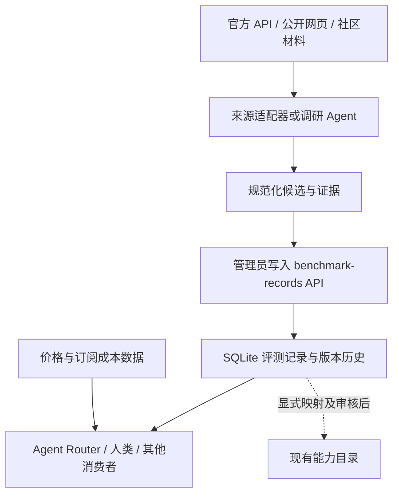

# 可追溯评测记录扩展（提案）

状态：供维护者评审，尚未实现。日期：2026-09-27。

## 为什么需要独立记录

[本轮数据缺口](../research/aa-storage-findings.md)显示，现有 model-effort 能力目录不足以无损保存评测结果：评分可能为负，模型有 fallback 变体、估计值和弃用标记；Coding Agent 分数属于 harness、模型与设置的组合。未知 effort 也不能自动变成目录里的 null 或 none。

建议在现有 AC 服务内新增独立评测记录资源。API、SQLite、管理员认证沿用现有服务；不另起服务，也不改变价格公式。Agent Router 等消费者读取评测记录自行决策，AC 不在这一层算“综合质量分”或选择模型。

## 最小数据合同

每条记录表示某来源对一个模型配置或 Agent 系统配置的一组评测。来源自己的稳定行 ID 是主身份的一部分；规范模型 ID 只是可选映射。没有可靠映射也允许保存原始事实。

| 字段组 | 内容及约束 |
| --- | --- |
| 来源身份 | `source_id`、`source_record_id`；不把 AA 写死为资源类型 |
| 被测对象 | `subject.kind=model/system`；来源模型名、provider、模型列表、harness 名与版本、配置和 variant。双模型系统保留两个模型，不强行选一个 |
| effort | 原始标签与 `state=known/unknown/not_applicable`；明确的 `none` 是 known 值。推断映射另记依据，不改写原始标签 |
| 规范映射 | 可选 provider/model/effort/agent_id 及映射依据、状态；不能通过名字相似即自动确认 |
| 指标数组 | metric ID、名称、版本、版本依据、十进制字符串值、unit/scale、方向、可选成分与权重；每项可独立携带评测用 harness 名称、版本、发布日期、配置和评测时间。同一 Agent 的不同 benchmark 不要求相同 harness 版本；允许有限负数，不使用价格金额校验器，不接收 NaN/Infinity |
| 质量标记 | estimated、deprecated、fallback；未知标记保留未知，不默认 false |
| 时间 | `retrieved_at` 必填，`evaluated_at` 可空，`recorded_at` 服务生成；harness 发布日另存，不能充当评测日 |
| 证据 | 来源 URL、采集方式和版本、内容 hash、来源行的 JSON 摘录及可选受控证据引用；hash 明确区分原始响应字节与规范化行，附算法和哈希对象，不用行 hash 冒充整页 hash；不把整个网页、凭据或账户信息塞入记录 |
| 历史 | `row_version`、规范内容 hash；保留修订前记录 |

来源未提供指标版本时允许未知；从方法页推断的版本要带依据。本轮榜页 v4.3 与方法页 v4.3.2 的差别不能悄悄抹平。百分比、0–1 reward、Elo 也不互相换算。

组合评测的 token、耗时、成本可以作为带单位和口径的指标保存。它们是该次评测的观测值，不是当前官方报价或用户实付价，不能覆盖价格目录。

## 存储与 API

新增一张 `benchmark_record_history` 表，保存来源身份、版本、内容 hash、时间和经过合同校验的 JSON 正文；唯一键为来源身份加版本。最新记录可由查询选出，首版不另建缓存或通用知识图谱。

拟议接口（尚不可调用）：

- `PUT /v1/benchmark-records/{source_id}/{source_record_id}`：创建或更新，正文带 `expected_version`。
- `GET /v1/benchmark-records`：分页；按来源、subject 类型、已确认的模型/Agent 映射、metric 筛选。未知映射仍能按来源查询。使用按来源身份排序的游标；游标绑定筛选条件及首屏读取截止点，后续页不混入截止点后的更新。
- `GET /v1/benchmark-records/{source_id}/{source_record_id}`：当前记录。
- `GET /v1/benchmark-records/{source_id}/{source_record_id}/history`：版本历史。

首版沿用能力 API 的管理员认证。公开文档不意味着所有采集数据都能匿名读取或再分发。以后如需要只读消费者凭据，另行设计权限。

写入规则：事务中读取当前版本，内容相同则返回当前版本且不追加历史；内容不同且版本过期返回 409；新记录以 expected_version=0 创建。内容比较采用字段排序的确定性 JSON，保留十进制字符串精度；排除服务生成的 recorded_at 和单纯重复抓取的时间。每个新版本保存其来源材料实际 retrieved_at，相同内容重复抓取不更新此时间，因此它不是“最近检查时间”。来源内容、映射、解释或指标变化才产生新版本。首版不承诺独立 Idempotency-Key 存储。旧版本读取与当前值均须可复现。

数据库 schema 从 2 升到 3；迁移先备份，失败回滚。价格快照 schema、哈希、公式和导出保持原状。旧程序对未来数据库版本应明确拒绝打开，不能把数据库版本号改回去冒充降级。

## 与现有能力目录的关系

完整评测记录是带来源评测事实的载体；现有能力目录继续承担简明能力描述和兼容读取。首版不自动双写，后续若增加投影，必须能追溯到具体记录版本，并明示是投影。

不要只把“负分”放到新表、把同一评测的正分继续单独放旧表。建议迁移候选是本轮完整 67 条重点模型记录和 20 条系统组合；旧目录已批准的 24 条不删除。写入新资源仍需提交具体批次与证据供确认，不因能保存 estimated/deprecated 就把它们当推荐依据。

## 分期与验证

| 阶段 | 可交付能力 | 验收 |
| --- | --- | --- |
| 第一阶段：合同与存储 | 上述资源、历史、认证与 schema 迁移 | 普通模型、fallback、负分、unknown/none、estimated、双模型系统都能无损往返；并发冲突 409；重复提交不增版本；无认证 401；迁移备份恢复；原价格快照字节不变 |
| 第二阶段：AA 导入适配 | 将已有来源材料转成通用记录；模型表与系统表分别映射 | 67 与 20 分组逐条核对；来源 URL/hash/时间齐全；不把组合分归到模型；负值不丢失；再次运行零新增版本；缺少证据的记录明确隔离 |
| 第三阶段：消费者查询 | Agent Router 按来源和对象查记录、区分版本与缺失 | 对同一模型不同 effort、variant、harness 分别返回；无数据返回缺失状态；不同量纲/方法版本不自动排名；不依赖 AO 角色或终端 |

每个实现阶段开始前补齐独立 spec、test doc 和 exec plan；本提案不构成实现或新批次写入许可。公开仓库只保留获取方法、合同和必要示例；原始数据的再分发需要单独核实来源许可。

## 待确认的设计选择

推荐采用“独立评测记录资源 + 保留现有能力目录”的方案。替代方案是继续给能力行追加字段，但它仍难表示多模型系统、不同 harness 和未映射来源记录；为这些场景扩展主键会扩大兼容性影响。确认该方向后再细化第一阶段三文档。
