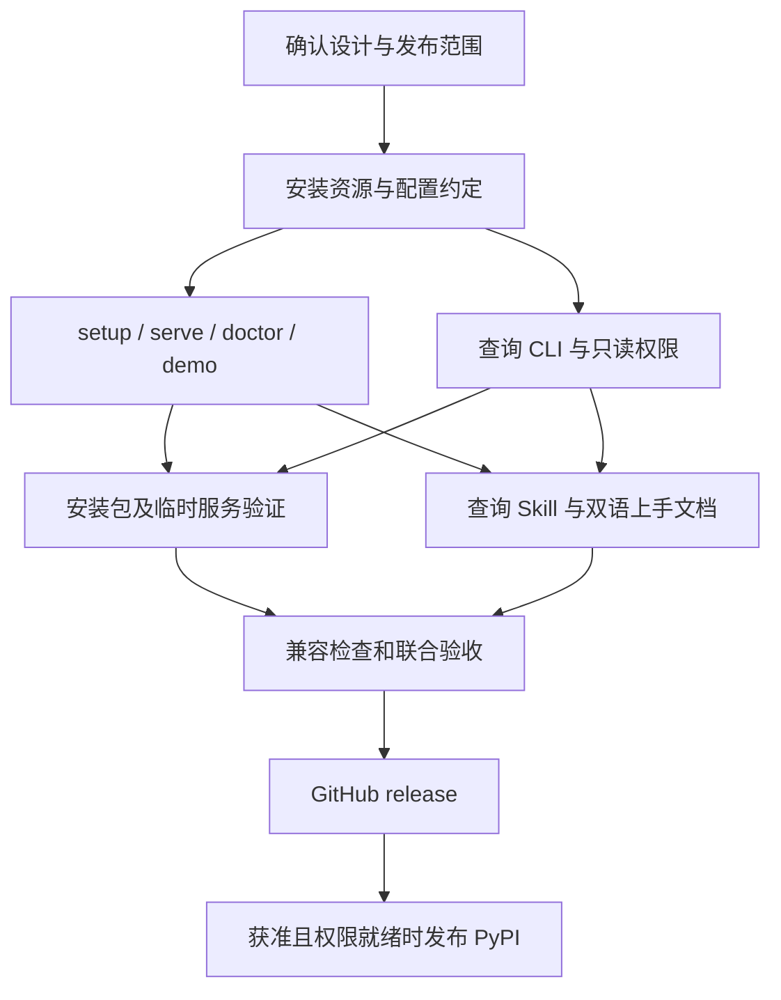

# 安装、查询与首次使用设计

日期：2026-10-05。状态：实现与验收通过，GitHub v1.1.0 已发布，PyPI 待维护者账号配置。当前命令见 [运行参考](../reference.md)，实际检查见 [验证记录](../research/developer-experience-validation-20261006.md)。

目标是让新用户不必克隆源码或寻找测试文件就能完成一次估算，让外部 Agent 查询带来源、时间和版本的价格与能力事实。ac 提供事实和估算，ar 或其他调用者做 Agent/model/effort 选择。

独立审阅使用 Cursor CLI 的 `claude-opus-5-5-high`，外部资料由协调 Agent 补查；完整输出、采纳与调整见 [调研记录](../research/developer-experience-20261005.md)。

## 修改前的阻力

- `ac` 入口在 `offline.py`，只有 `estimate`、`collect` 和 `data`。服务启动需要手写 uvicorn factory 命令。
- 当前演示快照在 `tests/fixtures/`，请求在 `examples/`；wheel 没有完整的可直接执行演示资源。
- 两个 Skill 都是数据维护用途，缺少消费侧查询 Skill。Skill 安装不会安装 Python 服务或初始化数据。
- 能力读写都使用 `ACB_ADMIN_TOKEN`。查询 Agent 当前拿到的是管理凭据。
- `Settings` 只读取环境变量；复制 `.env` 不等于服务会加载它。数据库默认位置取决于当前工作目录。
- OpenRouter 解析器固定 `openai/gpt-4o-mini`。环境初始化成功不代表全模型、全 effort 或全 Agent 目录已经填充。

## 方案比较

| 方案 | 收益 | 代价 |
| --- | --- | --- |
| 薄查询 CLI + Skill + 现有 HTTP 服务（推荐） | 复用现有合同，适合 Agent 和开发者，安装包能独立演示 | 查询能力仍需要运行本地服务 |
| CLI 全部直接读取 SQLite | 可省去服务启动 | 新增数据库消费路径、锁和权限约定；与现有 API 容易分叉 |
| 先做 MCP 和托管服务 | 可接入更多工具及免本地服务的用户 | 增加协议、部署、认证和运维范围，延迟当前上手问题的解决 |

本轮选择第一种。新模块只处理命令、配置和 HTTP 适配，不重写估算公式、存储或批次执行器。

## 用户路径和拟议接口

### 试玩

先从 Git release tag 安装 CLI；PyPI 可作为单独的发布选择。uv 支持从 Git 安装工具与临时运行工具，见 [官方文档](https://docs.astral.sh/uv/guides/tools/)。具体 tag 在验证和发版后填写，不在 README 提供尚不存在的 tag。

```text
ac demo
```

演示使用安装包内的合成价格快照和请求，不联网、不需要 token、不修改真实数据库。输出标记 synthetic，包含估算金额、口径与版本。保持原有离线 `ac estimate --snapshot ... --request ...` 可用。

### 建立本地服务

```text
ac setup
ac serve
ac doctor
```

`setup` 创建配置、随机凭据与空数据库，明确报告目录仍为空；重复执行保留已有配置和记录。用 setup 区别于 `ac data plan --mode init` 的真实资料初始化。新 CLI 默认数据目录独立于 Git checkout，且支持指定路径。旧 `ACB_DB`、`ACB_ADMIN_TOKEN` 与 uvicorn 启动方式保持兼容；不静默搬迁本机已有数据库。

`serve` 前台运行，默认 loopback；首次缺少配置时提供明确的 setup 入口。增加显式 `--setup` 组合配置建立与前台启动，不引入后台进程管理器。Ctrl-C 退出，端口冲突时给出换端口或连接已有实例的提示。

`doctor` 检查配置、数据库、服务连接和目录覆盖情况，输出机器可读结果及可执行修复建议；不显示凭据，不采集账户资料。其检查不修改真实目录。

### 查询和估算

```text
ac query prices
ac query agents
ac query model-efforts --provider PROVIDER --model MODEL
ac query evidence --id EVIDENCE_ID
ac query research --id RESEARCH_ID
ac estimate --server SERVER --request request.json
```

默认 JSON，另提供显式表格展示。查询沿用现有 HTTP 字段、null 和版本；过滤结果不声称源目录全覆盖。`estimate` 的在线服务模式与离线快照模式互斥，原有离线用法与返回结果保持兼容。

新 `costbook-query` Skill 说明：检查服务与目录状态，查询候选事实或请求估算，检查来源时间和版本，报告缺失项，将结果交给调用者。Skill 不调度 Agent，不把评分自动当作成功概率，不自动导入或改写数据。Skill 自带必要参考，标准安装后不依赖源码 checkout 内的相对路径。

### 真实数据初始化和更新

沿用 `costbook-initialize` + `ac data plan/validate/diff/apply/verify`。环境建立、合成演示与真实目录填充分别报告。默认不扫描用户账户、订阅或本机 Agent 配置。

推荐首版由使用者选择来源和范围，通过已复核批次导入。全量 OpenRouter、AA 自动同步、公开维护数据包和定时更新不隐含在本轮功能中。独立决定是否投入公开数据维护服务；公开页面可访问不代表数据可以打包再分发。

## 查询凭据

推荐增加可选只读凭据，管理凭据仍兼容旧调用。新查询 CLI 优先使用只读凭据。只读凭据允许价格/能力/证据查询及 M0–M6 估算中的能力信息，不允许 contribution、publish、能力 PUT、observations 写入或 M7 私有测量查询。保持现有公共价格端点行为，不扩大公开的私有数据范围。

这是一项小型兼容扩展，不建设用户账户、RBAC 平台或远程身份服务。具体 token 配置名称在实现规格中固定。

## 代码与目录

保留 `src/agent_costbook/`、`tests/`、`skills/` 和 `docs/` 主结构。增加明确用途的小模块：CLI 分派、配置与初始化、消费侧查询；在 `src/agent_costbook/` 中打包只包含合成数据的 demo 资源，使用包资源 API 读取。

增加 `agent-costbook` 长命令别名和版本查询，保留既有 `ac` 及 export/backup/migrate 入口。包内 demo 资源作为该演示的单一来源，原有兼容性测试 fixture 不要求永久复制成同一份新资源。

复用现有 HTTP 传输和错误处理，只有确实需要多个调用方共享时才提取小模块。不把本轮体验改进变成重写 `data_batch.py` 或 `Store`。

公开文档增加：

```text
docs/
  getting-started.md
  guides/agent-integration.md
  guides/catalog-maintenance.md
  reference.md
  data-sources.md
  research/developer-experience-20261005.md
skills/
  costbook-query/SKILL.md
  costbook-query/references/
  costbook-initialize/SKILL.md
  costbook-contribute/SKILL.md
```

README 保持英中入口。首屏解释用途和 ac/ar 关系，然后展示一条可执行演示及结果，再给开发者、查询 Agent、数据维护者三条入口。详细公式继续留在 reference；新增命令实现并验证之前不写成当前功能。

## 发布与传播

P0：独立安装包演示、setup/serve/doctor、查询 CLI/Skill、可选只读凭据、指南和兼容验证。推荐作为向后兼容的 1.1.0 候选；实际 tag 在检查通过后创建。

P1：决定后配置 PyPI Trusted Publishing 与正式版本安装；制作短终端演示和真实 HTTP/Skill 集成例子，完善数据纠正 issue 模板。文档站、Docker、Homebrew 和 MCP 按实际反馈排序。

传播材料围绕可验证差异：来源与版本可追溯、估算可复现、本地资料控制、不同成本口径分别报告。发布短演示、可复制示例和具体贡献入口；不宣称覆盖全部模型或保证省钱。外部社区发帖由维护者选择渠道，不由 Agent 自动发布。

观察安装成功、首次查询成功、问题类型、贡献和 stars 的变化；不将获星数量作为本轮功能验收，也不声称 README 变化必然提高 stars。

## 验收

1. 在临时、干净的用户目录安装 wheel，从源码目录外运行 demo，得到约定合成结果；不访问网络或真实数据库。
2. setup 重复运行不覆盖 token、配置、现有数据；新 CLI 使用明确路径，已有环境变量及旧启动方式不变。
3. 启动、健康检查、查询价格/Agent/model-effort、在线估算及 Ctrl-C 退出在临时服务中贯通。错误 token、未启动服务、空目录、缺失模型、端口占用有可判断错误。
4. 查询输出保留来源、原始观察时间、null 和版本；不以重新查询时间替代事实时间。查目录不会写数据。
5. 只读凭据可消费规定资源，不能写入或读 M7 私有测量；管理凭据和公共价格调用保持兼容。
6. 通过标准 Skill CLI 的仅列出模式识别三个 Skill；复制 Skill 后，其必要参考仍能访问。一次 Agent 实际调用验证另存证据，不能用目录发现代替执行验证。
7. 既有测试、打包、文档链接和样例验证通过。增加安装/CLI 集成覆盖；按实际 CI 结果公布平台支持，不能凭路径设计声称已经验证所有系统。

## 实施顺序

建立独立 worktree `ac-dx-1.1`（分支 `feature/ac-dx-1.1`）。创建时已选 Orca Runtime 不可用，因此先用 Git 建立隔离 checkout；Runtime 恢复后，Orca 已发现该 worktree，显示名设为 `ac-dx-1.1`，关联本仓主 worktree，Kanban 状态为 `in-progress`。本轮在这一份文档补充执行步骤和仓库原生验证，不另外拆三份短文档。Cursor Opus 5.5 的任务是本轮独立方案审阅；维护者随后指定：稍复杂实现使用 Grok 4.7 High，简单文档和 Skill 任务使用 agy Gemini 3.8 Flash High。入口文件由一名实现者负责，避免并行修改冲突。



## 已确认的发布范围

| 决策 | 选项 | 建议及理由 |
| --- | --- | --- |
| 包发布渠道 | 本轮只发 GitHub tag；或完成验收后同轮发布 PyPI | 推荐准备并发布 PyPI，减少使用门槛；是否有名称和发布权限需要核实，不假定已经具备 |
| 默认真实数据策略 | 使用者自行研究/提交批次；内置少量公开价格导入；长期维护公共完整目录 | 推荐本轮先用明确范围的批次路径，单独规划公共数据维护，避免把安装入口扩成数据服务项目 |

前台运行、三类 Skill 分工、独立数据目录和只读凭据是本方案推荐的实现默认值；维护者可以在确认方案时一并调整，不需要逐个审批内部模块和文件名。

维护者已接受上述推荐：准备 PyPI 正式包与 Trusted Publishing；真实目录继续由使用者选择范围、Agent 调研并提交批次。本轮没有新增产品决策。PyPI 账户权限就绪是外部发布条件，不阻塞代码、验证和工作流准备。

## 执行清单

采用 writing-plans 和 test-driven-development 的实现/验证顺序，不新增测试框架。各阶段先加行为测试并观察预期失败，再实现及验证；文档变更检查链接和实际命令即可。

### 1. 配置、独立演示和服务入口（Grok 4.7 High）

- [x] 在 `tests/test_local_cli.py` 写 setup 幂等、demo 脱离源码、缺少配置/端口占用/doctor 不写库等行为测试，并运行确认失败。
- [x] 新增 `src/agent_costbook/local.py`，复用 Settings/Store 和 uvicorn；配置用 JSON 与标准库平台目录规则。`ACB_CONFIG` 或 `--config` 选配置文件，`--db` / `ACB_DB` 优先于配置；旧 factory 的 cwd 默认不变。
- [x] 包内新增 `src/agent_costbook/demo/` 合成资源，使用 importlib.resources，不复制真实运行数据。setup 配置保存本地 admin/read token，POSIX 文件 0600/目录 0700；输出只有路径与是否已设置，不打印 token。
- [x] `offline.py` 注册 setup/serve/doctor/demo/version；serve 默认 loopback、前台，显式 `--setup` 可创建配置与空库。服务/查询默认端口 8080，可指定端口；不自动选新端口而让调用者连接到错误实例。
- [x] 对外命令增加 `agent-costbook` 别名，既有入口保留。
- [x] 运行 `uv run pytest -q tests/test_local_cli.py`，记录通过与实际限制。

### 2. 消费查询和只读能力（Grok 4.7 High）

- [x] 在 `tests/test_query_cli.py`、`tests/test_read_auth.py` 写临时 HTTP 服务测试：过滤、缺失、错误身份、只读不能写/M7、旧 admin 可用，先运行观察失败。
- [x] Settings 增加可选 `read_token`（默认空），环境变量 `ACB_READ_TOKEN`。能力 GET/估算能力附加信息允许 read 或 admin，M7 和写操作只允许 admin。既有 public 价格行为不变。
- [x] 新增 `src/agent_costbook/query.py`，复用现有 HTTP 传输，提供 prices/agents/model-efforts/evidence/research，默认 JSON、显式表格；数据字段保留 null、来源、时间、版本。model-efforts 不给 effort 表示列档，显式空 effort 查 null 档。
- [x] estimate 新增 `--server` 在线模式，与 `--snapshot` 互斥，复用 EstimateIn 与 HTTP 合同；不替消费者排名或派遣。
- [x] CLI 消费凭据优先 `ACB_READ_TOKEN` / 配置 read token，必要时兼容 admin；不得把 token 放在 CLI 参数或输出。配置不存在但显式环境和 server 已够时不要求先 setup。
- [x] 运行上述测试及 `tests/test_capabilities.py tests/test_ar_contract.py`，验证现有行为。

### 3. 安装体验、查询 Skill 与文档（agy Gemini 3.8 Flash High）

- [x] 创建自包含 `skills/costbook-query/SKILL.md` 与确有必要的参考；只查询事实和估算，识别 synthetic、空库、新鲜度与缺失，不自动写入。
- [x] 编写 getting-started、Agent 集成和目录维护指南；英中 README 首屏一致，复制粘贴示例与实际 CLI 一致。尚未创建的 tag/PyPI 包必须标待发布或使用实际 Git ref。
- [x] 更新 AGENTS 文档索引，Skill 复制后不依赖 checkout 文档相对路径。
- [x] 新增首用失败/数据纠正 issue 模板、简短源码发布说明和可复用终端示例；外部社区推广不自动发布。
- [x] 配置 GitHub release 和 PyPI Trusted Publishing 工作流：tag 发布、构建/测试、发布环境绑定；不存发布 token。只有真实权限和发布回执证实后才将 PyPI 标为已发布。

### 4. 联合验收和发布

- [x] 扩展 `tests/test_install_smoke.py` 从最终 wheel 装入干净环境，源码目录外运行 demo/setup/serve/doctor/query/estimate。
- [x] 运行 `uv run pytest -q`、`uv build`、文档链接及 demo 检查；检查打包资源和私有目录排除。
- [x] 独立按合同复核，再审查复杂度与权限；发现问题交原执行 Agent 修正。
- [x] 三个 Skill 标准发现验证；用独立 Agent 加载查询 Skill 对临时合成服务完成实际查询，保存结果。
- [x] 合并已验证改动、提交 push，核实 GitHub CI 与 release。
- [x] 准备 PyPI workflow/environment 与精确的 Trusted Publisher 配置说明；维护者账号设置尚未就绪，未执行 PyPI 发布。

## 本地验收结果

2026-10-06：223 项测试通过；安装包在源码目录外完成使用路径；独立 agy 消费者执行复制出来的查询 Skill，临时数据库及 WAL/SHM 哈希未变。标准安装器发现三个 Skill，各 Skill 校验通过；合成 demo 和文档批次命令通过。发行与账号状态另见[版本说明](../releases/developer-experience-1.1.md)。
