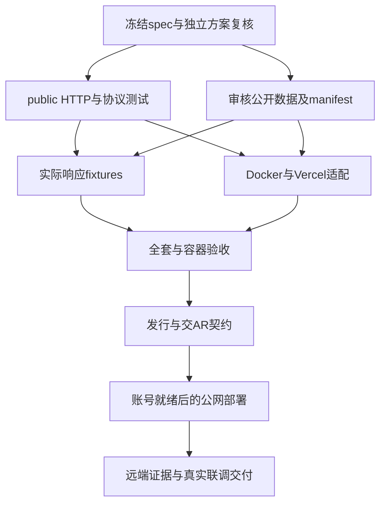

# 公共服务执行计划

> For agentic workers: use subagent-driven-development or executing-plans; follow scoped ownership, TDD and repository-native checks. Human 已授权公共服务业务边界，本计划落实已授权工作，不新建审批生命周期。

Goal：交付复用1.1.0的匿名公开HTTP、审核数据、Docker及免费部署适配。
Architecture：独立public factory +共享既有计算响应逻辑；本地管理员维护、固定审核SQLite发行物、线上只读。Tech：Python/FastAPI/Pydantic/SQLite/uv/Docker；首选Vercel原生FastAPI（容器仓库费用未核实则不启用），未就绪记录未部署。

## 工作区与执行角色

Orca worktree `ac-public-1.2`，分支 `JasonJarvan/ac-public-1.2`，基于main `30f7764`；路径 `/home/shenzhou/orca/workspaces/agent-costbook/ac-public-1.2` 已由Orca创建回执确认。父工作区保留；AR仓与用户数据不改。简单文档/声明用agy Gemini3.8FlashHigh，契约/源码/数据生成与复核用Grok4.7High。只创建必要的CLI worker，不新增无关OA或tab。

## 1 设计复核

- [x] 独立Grok完整读取spec/test/本计划和AR消费要求，只提出具体缺口、复用与权限/数据持久性问题；修正一次，不让建议生成新系统。

## 2 public HTTP（Grok，源码所有者）

- [x] 先写 `tests/test_public_api.py`，跑出匿名能力、snapshot envelope、private/M7拒绝、missing usage、限额与无body泄漏的预期失败。
- [x] 新建 `src/agent_costbook/public_api.py`（public app/DTO/只读访问），`public_data.py`（已审发行物验证）。仅确需复用的估算构造从 `api.py` 提取共享函数，private factory行为保留；不重写Store/公式，不增加SQLite之外的新backend。
- [x] 64KiB、64候选、实例60/60s、ETag与safe422；descriptor准确说明无usage_assumptions/remote writes。新增结构各有验收消费者。
- [x] 针对public和既有read_auth/capability/AR契约检查，通过后只提交拥有文件。

## 3 公开数据（Grok/协调者，独立文件）

- [x] 仅公开官方价格/能力，独立新库，source URL/as_of/retrieved_at真实，缺项保持null。采集方法落docs/research；不导入private live数据/AA未获许可数据。
- [x] `scripts/build-public-catalog.py` / `tests/test_public_data.py`，复用贡献/发布和能力DTO，验证后编译固定SQLite（package public_catalog资源），记录JSON源/manifest/fileSHA/publisher与所有公开版本。首次正式发行UUID生成后固化发布物；未发行候选可在审核修正后重新封存，后续更新复用前版authoring DB，不在启动生成新身份。
- [x] 价格/token×1M转换用Decimal；原始证据只保留必要事实摘要与引用，无原网页全文。至少一条可算真实候选，覆盖/缺项可核验。

## 4 Docker与部署说明（agy，声明所有者）

- [x] Dockerfile、deploy/vercel-container/Dockerfile.vercel、app.py/vercel.json原生入口、.dockerignore、compose/selfhost说明、GHCR build/check workflow；env只为public DB/manifest/PORT等，不包含key，镜像非root默认只读。
- [x] 原生Docker实际build/run/多实例/重启/纯HTTP客户端 smoke；跨平台/网络限制不虚构验证。
- [x] 托管官方依据与免费条件、不可变持久数据更新/回滚、无在线写、quota用尽/冷启动限制写清楚。无外部存储或主机权益不自动采购/升级付费。

## 5 复核、发行和联调

- [x] 源码与协议独立复核，修正确认问题；整体`uv run --locked pytest -q`、build、doc/demo checks、镜像smoke与真实公开fixture。
- [x] 服务minor版本1.2.0，API/schema保留1；版本期望与lock/打包入口一起更新，包保留旧CLI。
- [x] 准备合同fixtures/OpenAPI、源与覆盖、新鲜度/缺项，先发AR可消费契约；URL未部署时明确null。
- [ ] 合并/push并核实CI/发行。使用已有云账户授权时才实际部署；未授权继续可交代码/Docker，不标全部线上完成。保留工作区。

## 已获得的运行证据（2026-10-08）

- 本地实际 public app 与只读 Docker 的独立 HTTP 客户端各通过22项检查，fixture来自真实HTTP。
- Docker Python3.12.15，UID10001，PORT9090，read-only/tmpfs；重启后完整价格/能力行、publisher/version/hash一致，消费后数据库文件hash未变，SIGTERM退出0。
- public API初次51项、数据24项、CLI/安装初次34项；额外发行包检查证实安装包独立启动public app，排除嵌套私有SQLite。最终OpenAPI补齐后全套305项通过，API54项/数据27项；独立原生HTTP与最终Docker检查均23项通过，标准JSON Schema验证20份实际响应。
- 公开库17价格/5Agent/33model-effort；12条件价缺口、Google cache-write条件价为空，AA数值/私有记录排除。
- AR已接受spec/test/exec并收到实际fixture/OpenAPI路径；公网URL未部署，云账户授权问题待Human回答。

- Grok广泛审阅发现OpenAPI空success schema，已补成功/错误/缓存headers并核验；Sol6.1短审发现撤去身份的静默保留，已安全拒绝且独立复核闭合。超长snapshot数字返回404，缺目录info允许null，500安全信封已描述。
