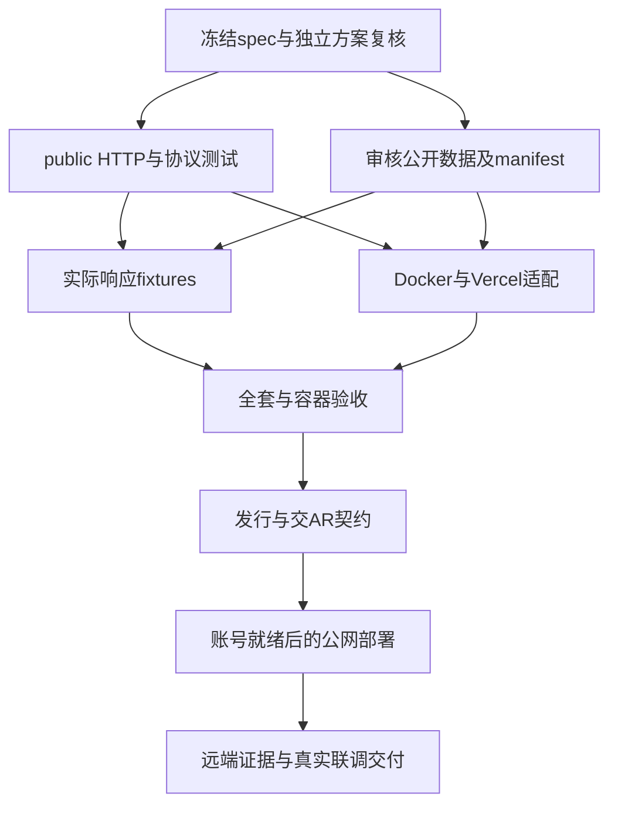

# 公共服务执行计划

> For agentic workers: use subagent-driven-development or executing-plans; follow scoped ownership, TDD and repository-native checks. Human 已授权公共服务业务边界，本计划落实已授权工作，不新建审批生命周期。

Goal：交付复用1.1.0的匿名公开HTTP、审核数据、Docker及免费部署适配。
Architecture：独立public factory +共享既有计算响应逻辑；本地管理员维护、固定审核SQLite发行物、线上只读。Tech：Python/FastAPI/Pydantic/SQLite/uv/Docker；首选Vercel原生FastAPI（容器仓库费用未核实则不启用），未就绪记录未部署。

## 工作区与执行角色

Orca worktree `ac-public-1.2`，分支 `JasonJarvan/ac-public-1.2`，基于main `30f7764`；路径由Orca创建回执确定。父工作区保留；AR仓与用户数据不改。简单文档/声明用agy Gemini3.8FlashHigh，契约/源码/数据生成与复核用Grok4.7High。只创建必要的CLI worker，不新增无关OA或tab。

## 1 设计复核

- [x] 独立Grok完整读取spec/test/本计划和AR消费要求，只提出具体缺口、复用与权限/数据持久性问题；修正一次，不让建议生成新系统。

## 2 public HTTP（Grok，源码所有者）

- [ ] 先写 `tests/test_public_api.py`，跑出匿名能力、snapshot envelope、private/M7拒绝、missing usage、限额与无body泄漏的预期失败。
- [ ] 新建 `src/agent_costbook/public_api.py`（public app/DTO/只读访问），`public_data.py`（已审发行物验证）。仅确需复用的估算构造从 `api.py` 提取共享函数，private factory行为保留；不重写Store/公式，不增加SQLite之外的新backend。
- [ ] 64KiB、64候选、实例60/60s、ETag与safe422；descriptor准确说明无usage_assumptions/remote writes。新增结构各有验收消费者。
- [ ] 针对public和既有read_auth/capability/AR契约检查，通过后只提交拥有文件。

## 3 公开数据（Grok/协调者，独立文件）

- [ ] 仅公开官方价格/能力，独立新库，source URL/as_of/retrieved_at真实，缺项保持null。采集方法落docs/research；不导入private live数据/AA未获许可数据。
- [ ] `scripts/build-public-catalog.py` / `tests/test_public_data.py`，复用贡献/发布和能力DTO，验证后编译固定SQLite（package public_catalog资源），记录JSON源/manifest/fileSHA/publisher与所有公开版本。首次UUID只生成一次并固化发布物，后续更新复用前版authoring DB，不在启动生成新身份。
- [ ] 价格/token×1M转换用Decimal；原始证据只保留必要事实摘要与引用，无原网页全文。至少一条可算真实候选，覆盖/缺项可核验。

## 4 Docker与部署说明（agy，声明所有者）

- [ ] Dockerfile、deploy/vercel-container/Dockerfile.vercel、app.py/vercel.json原生入口、.dockerignore、compose/selfhost说明、GHCR build/check workflow；env只为public DB/manifest/PORT等，不包含key，镜像非root默认只读。
- [ ] 原生Docker实际build/run/多实例/重启/纯HTTP客户端 smoke；跨平台/网络限制不虚构验证。
- [ ] 托管官方依据与免费条件、不可变持久数据更新/回滚、无在线写、quota用尽/冷启动限制写清楚。无外部存储或主机权益不自动采购/升级付费。

## 5 复核、发行和联调

- [ ] 源码与协议独立复核，修正确认问题；整体`uv run --locked pytest -q`、build、doc/demo checks、镜像smoke与真实公开fixture。
- [ ] 服务minor版本1.2.0，API/schema保留1；版本期望与lock/打包入口一起更新，包保留旧CLI。
- [ ] 准备合同fixtures/OpenAPI、源与覆盖、新鲜度/缺项，先发AR可消费契约；URL未部署时明确null。
- [ ] 合并/push并核实CI/发行。使用已有云账户授权时才实际部署；未授权继续可交代码/Docker，不标全部线上完成。保留工作区。
