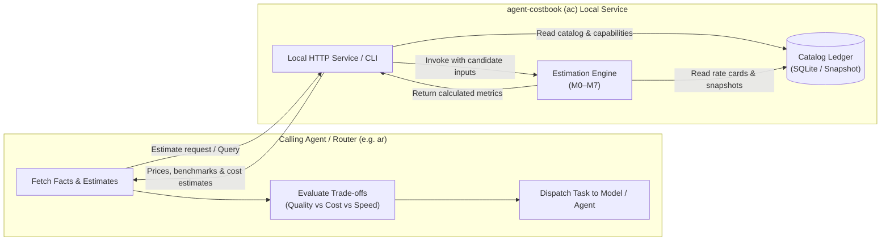

# Agent Integration Guide

This guide explains how autonomous agents, routing systems (such as `agent-router`), and agent frameworks consume facts and cost estimates from `agent-costbook` (`ac`).

---

## Architecture and boundary



### Invariants

1. **`ac` provides facts; consumers make decisions**:
   `ac` stores pricing rate cards, subscription parameters, observed capabilities, and deterministic cost formulas. It does not select a model, rank agents, or dispatch tasks.
2. **Deterministic and reproducible**:
   Calculations carry snapshot IDs, source timestamps, and formula versions. Given the same inputs, `ac` produces identical results.
3. **No hidden defaults or fabrications**:
   Unknown prices, context lengths, or benchmarks are returned as `null`. Missing data is never coerced to zero or one.
4. **Weights are not success probabilities**:
   Capability proxy weights `w` (used in methods M3 and M5) are linear indices, not measured empirical success rates. Returned metrics are tagged `do_not_reweight_for_routing` to prevent double-weighting in downstream routing equations.

---

## Integration methods

### Option 1: Using the `costbook-query` Skill

For Codex, Cursor, and other agent platforms supporting standard Skills, install the pre-packaged query skill:

```sh
# For Codex
npx skills add JarvanAI/agent-costbook --skill costbook-query --agent codex --global

# For Cursor
npx skills add JarvanAI/agent-costbook --skill costbook-query --agent cursor --global
```

The skill is self-contained and read-only. It instructs agents how to query facts, run estimates, check readiness, and interpret missing or stale data.

### Option 2: CLI integration

Calling agents can execute the `ac` CLI directly as subprocesses:

```sh
# Check service health and catalog coverage
ac doctor

# Query model pricing (table format available via --format table)
ac query prices --provider openai --model openai/gpt-4o-mini --format json

# Query capability facts for a model tier
ac query model-efforts --provider openai --model openai/gpt-4o-mini --format json

# Run task cost estimation against running service (returns JSON; --format is not supported on estimate)
ac estimate --server http://127.0.0.1:8080 --request request.json
```

> [!NOTE]
> The `--format` flag (`json` or `table`) is supported exclusively on `ac query` subcommands. `ac estimate` outputs JSON only and does not accept `--format`. In online mode (`--server`), `ac estimate` accepts `--config` to locate configuration and credentials, and refuses offline-only flags (`--publisher`, `--now`, `--max-age-seconds`). In offline mode (`--snapshot`), `--publisher` is an optional verification pin, and `--now` / `--max-age-seconds` provide offline freshness evaluation.

### Option 3: Local HTTP API integration

Agents can communicate directly with the local HTTP server (default `http://127.0.0.1:8080`).

#### Authentication

- Public endpoints (`/health`, `/v1/catalog`, public estimates, evidence, research) do not require authentication.
- Capabilities endpoints (`/v1/capabilities/*`) and capability-enriched estimates require a read token or admin token:
  ```http
  Authorization: Bearer <ACB_READ_TOKEN>
  ```
  The read token is sufficient for all query needs. Admin credentials are only needed for writes or M7 historical measurements.

#### Endpoints

| Endpoint | Method | Description |
| --- | --- | --- |
| `/health` | `GET` | Service readiness probe |
| `/v1/catalog` | `GET` | Complete published pricing catalog |
| `/v1/capabilities` | `GET` | Recorded Agent capabilities and model-effort capability records |
| `/v1/capabilities/agents?agent_id=` | `GET` | Specific agent capabilities |
| `/v1/capabilities/model-efforts?provider=&model=&effort=` | `GET` | Specific model-effort tier capabilities and benchmarks |
| `/v1/estimates` | `POST` | Deterministic cost estimation across candidate models |

---

## Evaluating task estimates (`/v1/estimates`)

Send a JSON payload specifying the estimation method, currency, task usage, and candidates. The following illustrates an evaluation request using the synthetic demo candidate fixture (`example`/`synthetic-m4`):

```json
{
  "method": "M4",
  "currency": "USD",
  "usage": {
    "uncached_input": "1000",
    "cache_read": "2000",
    "cache_write": "500",
    "billed_output": "400"
  },
  "extra_cost": "0.01",
  "candidates": [
    {
      "candidate_id": "synthetic-m4",
      "provider": "example",
      "channel": "api",
      "model": "synthetic-m4",
      "plan": "payg",
      "feature_scope": "text"
    }
  ]
}
```

### Response handling

*(Illustrative response excerpt using bundled demo rates and a synthetic capability observation fixture; not a third-party benchmark claim)*:

```json
{
  "publisher_id": "pub_sample",
  "data_version": 2,
  "formula_version": "ac-formulas-v1",
  "results": [
    {
      "candidate_id": "synthetic-m4",
      "status": "ok",
      "method": "M4",
      "metrics": {
        "cost": "0.0177",
        "currency": "USD"
      },
      "capabilities": {
        "status": "ok",
        "model_effort": {
          "context_length": 128000,
          "benchmarks": [
            {
              "name": "Synthetic Quality Index",
              "score": "75.5",
              "unit": "index",
              "source": "user_observation",
              "source_ref": "fixture://synthetic-benchmark-obs"
            }
          ]
        }
      }
    }
  ]
}
```

Check the following fields when processing candidate results:
- `status`: If not `ok`, check `missing_data` (model or rates not present in catalog), `conflict` (conflicting rates), or `unsupported_method`.
- `capabilities.status`: Will be `ok` when authorized, `not_authorized` if no valid token was passed, or `unavailable` if using offline snapshot calculation (`--snapshot`). **Important**: An authorized `ok` status indicates read permissions were granted, but `agent` or `model_effort` will still be `null` if no capability record exists for that entity in the catalog.
- `metrics.cost`: Stored as high-precision decimal strings. Parse using standard decimal libraries to prevent floating-point rounding errors.

---

## Handling data freshness and gaps

When consuming facts:
1. **Freshness**: Inspect `retrieved_at` on pricing records and `as_of` on capability rows. If the timestamp is older than your allowed threshold, note that the fact may be stale.
2. **Missing rates**: If a provider rate (e.g. `cache_read_per_million`) is `null`, `ac` treats that specific bucket as uncalculated rather than assuming it is free.
3. **Empty effort tier**: When looking up a model tier without effort specified, query with empty string `--effort ""` (or `effort=""` parameter) to target the default unquantified tier.

---

## Related documentation

- [Getting started](../getting-started.md)
- [Catalog maintenance guide](catalog-maintenance.md)
- [Service and CLI reference](../reference.md)
