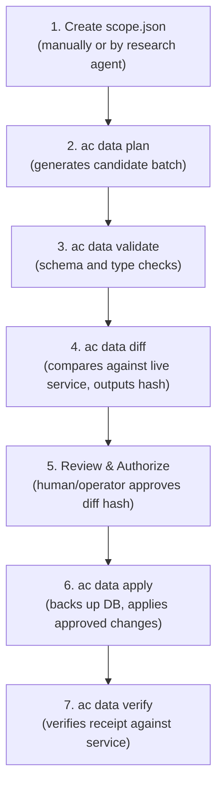

# Catalog Maintenance Guide

This guide describes how to initialize, update, and audit real pricing and capability facts in a local `agent-costbook` instance.

Catalog maintenance uses a reviewed batch process. Updates follow an explicit seven-step workflow:
`scope → plan → validate → diff → review → apply (with backup) → verify`.

---

## Overview and boundaries

- **No unapproved mutations**: The service does not crawl external websites automatically or mutate the catalog without an approved plan.
- **Traceable provenance**: Every price row requires source metadata (`retrieved_at`, `source_url`, `collector_kind`). Capability rows require `as_of` and `source`.
- **Administrative authorization**: Catalog writes require the administrative token (`ACB_ADMIN_TOKEN`).
- **Data safety**: Applying any batch requires an explicit backup of the database before writes are committed.
- **Third-party data rights**: The repository open-source license does not provide blanket coverage for retrieved external data. Third-party benchmarks (e.g. Artificial Analysis) and provider rate cards retain their original terms; inspect license terms and permissions before redistributing external data. See [Data sources and rights](../data-sources.md).

---

## Batch update workflow



### Step 1: Prepare a scope definition (`scope.json`)

A scope defines what models, providers, and capabilities you intend to research and maintain. You can create this file in any working directory.

Here is a minimal executable synthetic scope:

```json
{
  "kind": "agent-costbook.data-scope",
  "contract_version": 1,
  "id": "minimal-scope",
  "server": "http://127.0.0.1:8080",
  "visibility": "public",
  "items": [
    {
      "item_id": "synthetic-price",
      "category": "price",
      "collection": "manual",
      "mapping": "Synthetic example fixture. It is not an official provider quote.",
      "source": {
        "kind": "manual",
        "ref": "fixture://synthetic-price",
        "retrieved_at": "2026-10-05T00:00:00+00:00"
      },
      "candidate": {
        "research": {
          "title": "Synthetic example price",
          "markdown": "Example fixture only. Not an official quote.\n"
        },
        "evidence": [
          {
            "source_kind": "synthetic_fixture",
            "source_url": "fixture://synthetic-price",
            "collector_kind": "manual",
            "collector_name": "operator",
            "content": "synthetic uncached input 1 USD per million tokens",
            "retrieved_at": "2026-10-05T00:00:00+00:00"
          }
        ],
        "record": {
          "provider": "example",
          "channel": "api",
          "model": "example-small",
          "effort": "",
          "plan": "payg",
          "feature_scope": "text",
          "currency": "USD",
          "rates": {
            "uncached_input_per_million": "1",
            "billed_output_per_million": "2"
          }
        }
      }
    }
  ]
}
```

### Step 2: Plan the batch

Generate the batch directory from the scope:

```sh
# For the first initialization of a catalog
ac data plan --mode init --scope scope.json --out batch-dir

# For an update against existing records
ac data plan --mode update --scope scope.json --out batch-dir
```

`plan` writes candidate records into `batch-dir/`. Any items lacking candidate data are flagged as `needs_research`.

### Step 3: Validate candidate data

Validate format, rate shapes, and decimal precision:

```sh
ac data validate --batch batch-dir
```

Validation ensures decimal strings are valid numbers and required fields are present; unsupported categories (such as composite coding agent combinations) or invalid candidates are rejected with explicit validation problems and issues (`issues: ["unsupported_category"]` / status `refused`), never silently omitted.

### Step 4: Generate diff and approval hash

Remote operations (`diff`, `apply`, `verify`) operate against an active local service, so a running server (`--server http://127.0.0.1:8080`) is required. The `ac data diff`, `apply`, and `verify` subcommands resolve administrative credentials through the shared configuration helper using your setup configuration file (with optional `--config PATH`), while remaining fully compatible with environment variable overrides (`ACB_ADMIN_TOKEN`).

Compare candidate records against the active local service:

```sh
ac data diff --batch batch-dir --server http://127.0.0.1:8080
```

`diff` generates:
- `batch-dir/plan.json`: Canonical plan representation (document kind: `agent-costbook.apply-plan`).
- `batch-dir/plan.md`: Human-readable markdown summary table of proposed additions and changes.
- **Approval hash**: A SHA-256 fingerprint printed on stdout that covers canonical `plan.json` (cryptographically binding the target server, publisher ID, batch bytes, and baseline version).

### Step 5: Review and authorize changes

Review `batch-dir/plan.md`. Inspect proposed additions, modifications, and deletions to ensure accuracy and freshness. If approved, record the printed approval SHA-256 hash.

### Step 6: Apply changes with backup

Apply approved changes using the printed approval hash. `--backup-source` must specify the actual setup database path obtained from `ac setup` or `ac doctor` (or `$ACB_DB` if you explicitly set it in your environment):

```sh
ac data apply --batch batch-dir \
  --approved-diff-sha256 "<PLAN_SHA256>" \
  --server http://127.0.0.1:8080 \
  --backup-source "/path/to/agent-costbook/costbook.sqlite3" \
  --backup-destination "batch-dir/backup.sqlite3"
```

Safety constraints enforced during apply:
- **Hash verification**: If the diff hash does not match `plan.json`, writes are refused.
- **Mandatory backup**: `--backup-source` copies the database with restricted permissions (`0600`) to a private directory (`0700`) before modifications begin. The source path must be the real database file initialized by `ac setup` or `ac doctor`.
- **Conflict detection**: If a record was modified concurrently, that record is left as `conflict` and existing data is preserved.
- **Idempotence**: Re-running `apply` with the same approved hash will not create duplicate snapshots or versions.

### Step 7: Verify application

Verify that the local service matches the applied receipt:

```sh
ac data verify --receipt batch-dir/receipt.json --server http://127.0.0.1:8080
```

---

## Capability catalog updates

Individual capability records (recorded Agent capabilities or model-effort benchmark tiers) can also be maintained directly via the authenticated HTTP API.

> [!NOTE]
> Passing bearer tokens via command-line arguments (such as `curl -H "Authorization: Bearer ..."`) is not argv-safe in multi-user or automated environments, as arguments can be visible in process listings (`ps`). `ac` does not provide CLI token arguments for capability mutations—do not invent unofficial CLI flags. Instead, prefer direct HTTP requests with standard headers, or use a Python standard library script that reads credentials directly from `config.json` without exposing secrets in argv:

```python
import json, os, urllib.request

cfg_path = os.path.expanduser(os.environ.get("ACB_CONFIG", "~/.config/agent-costbook/config.json"))
with open(cfg_path) as f:
    cfg = json.load(f)

payload = {
    "agent_id": "agent-1",
    "expected_version": 0,
    "source": "user_observation",
    "as_of": "2026-10-05T00:00:00+00:00",
    "strengths": "edits files in repository worktree",
    "can_edit_files": True,
}

req = urllib.request.Request(
    f"{cfg.get('server', 'http://127.0.0.1:8080')}/v1/capabilities/agents",
    data=json.dumps(payload).encode("utf-8"),
    headers={
        "Authorization": f"Bearer {cfg['admin_token']}",
        "Content-Type": "application/json",
    },
    method="PUT",
)
with urllib.request.urlopen(req) as resp:
    print(resp.status, resp.read().decode("utf-8"))
```

### HTTP API specifications

**Record or update an Agent capability:**

```http
PUT /v1/capabilities/agents HTTP/1.1
Host: 127.0.0.1:8080
Authorization: Bearer <ACB_ADMIN_TOKEN>
Content-Type: application/json

{
  "agent_id": "agent-1",
  "expected_version": 0,
  "source": "user_observation",
  "as_of": "2026-10-05T00:00:00+00:00",
  "strengths": "edits files in repository worktree",
  "can_edit_files": true
}
```

**Record or update a model-effort tier and benchmark scores:**

```http
PUT /v1/capabilities/model-efforts HTTP/1.1
Host: 127.0.0.1:8080
Authorization: Bearer <ACB_ADMIN_TOKEN>
Content-Type: application/json

{
  "provider": "example",
  "model": "synthetic-m4",
  "effort": null,
  "expected_version": 0,
  "source": "user_observation",
  "as_of": "2026-10-05T00:00:00+00:00",
  "benchmarks": null,
  "default_for_agents": ["agent-1"]
}
```

---

## Related documentation

- [Getting started](../getting-started.md)
- [Agent integration guide](agent-integration.md)
- [Data sources and rights](../data-sources.md)
- [Service and CLI reference](../reference.md)
